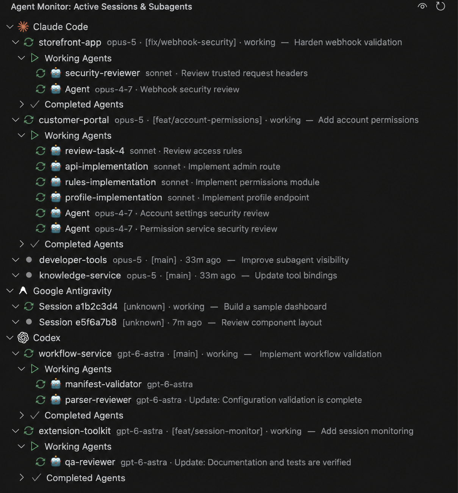

# Claude & Antigravity Agent Monitor

Lightweight VS Code / Antigravity sidebar that monitors your active **Claude Code** and
**Google Antigravity** sessions and their subagents in real time.



## Features

- **Sessions grouped by tool** — Claude Code and Google Antigravity under separate brand nodes.
- **Per session**: project, git branch, last-active time, session title (first user prompt), and the **LLM model** in use.
- **Subagents** — split into _Working_ and _Completed_, each showing its name, task, and **model**.
- **Model badges** (Claude Code): session model from the assistant stream (e.g. `sonnet-5`), and each subagent's own model from the `Agent` tool (e.g. `sonnet`), falling back to the session model when inherited. _(Antigravity logs carry no model info, so no badge there.)_
- **Real-time updates** via file watchers, plus a 15s safety refresh.
- **Active detection** via heuristics (recent writes, a pending reply, live subagents) — `lsof` is also checked on macOS/Linux but rarely finds anything, and is skipped entirely on Windows.
- **Startup delay** — waits ~10s on activation, showing a progress bar and loading state, so it doesn't compete with Claude Code for the log files while it boots.
- **Global on/off toggle** — an eye icon in the view title. Persisted as an application-scoped setting, so disabling it stops monitoring across **every** window/instance.

## Requirements

- VS Code or Antigravity **≥ 1.90** (Antigravity 1.107.0 base is compatible).
- macOS, Linux, or Windows.
- Reads `~/.claude/projects/**/*.jsonl` and `~/.gemini/antigravity-ide/brain/**/transcript.jsonl` (`%USERPROFILE%` in place of `~` on Windows).

## Claude Code compatibility

The parser depends on the Claude Code transcript format, which can change between releases.
Last validated against **Claude Code 2.1.218** (`KNOWN_COMPATIBLE_CLAUDE_VERSION` in
[src/claudeCompat.ts](src/claudeCompat.ts)). Claude Code stamps its `version` on every transcript
line; when a newer one appears in the logs the extension shows a one-time warning so the format can
be re-checked. After validating against a new release, bump that constant.

## Install

### From the extension store

Antigravity (and VSCodium, Gitpod, Cursor, Windsurf) ships the
[Open VSX Registry](https://open-vsx.org): open the **Extensions** view, search for
`Agent Monitor`, and install. Maintainers: see [docs/PUBLISHING.md](docs/PUBLISHING.md).

### From a local `.vsix`

Build the package:

```bash
npm install
npm run package        # → npx @vscode/vsce package --no-dependencies
```

Install it into **Antigravity** via CLI:

```bash
antigravity-ide --install-extension claude-agents-monitor-0.1.0.vsix --force
```

…or via the screen: **Extensions** view → `…` (top-right menu) → **Install from VSIX…** →
pick `claude-agents-monitor-0.1.0.vsix`.

…or into plain **VS Code**:

```bash
code --install-extension claude-agents-monitor-0.1.0.vsix --force
```

Then reload the window (Command Palette → _Developer: Reload Window_). The 🤖 **Agent Monitor**
icon appears in the activity bar.

To uninstall: `antigravity-ide --uninstall-extension leandrosilvaferreira.claude-agents-monitor`.

## Configuration

| Setting                       | Default | Scope       | Description                                                                                                               |
| ----------------------------- | ------- | ----------- | ------------------------------------------------------------------------------------------------------------------------- |
| `claudeAgentsMonitor.enabled` | `true`  | application | Monitor sessions. Disabling stops all log reading in every window; re-enable via the eye icon or by editing this setting. |

## Usage

- Open the **Agent Monitor** view from the activity bar.
- Expand a brand → a session → _Working_ / _Completed_ to see subagents.
- **Open Log File** / **Open Project Folder** are available on each session row (inline icons).
- Toggle monitoring on/off with the eye icon in the view title.

## Development

```bash
npm install
# Run in an Extension Development Host:
#   press F5 (launch config "Run Extension")
npm run build          # esbuild bundle → dist/extension.js
npm test               # vitest
npm run lint
```

To rebuild and reinstall after changes, repackage and install with `--force`, then reload the
window. For a clean upgrade instead of `--force`, bump `version` in `package.json`.

## License

[Apache License 2.0](LICENSE) — Copyright 2026 Leandro Silva Ferreira.

Free to use, modify, extend and redistribute, including commercially — **provided you keep
the attribution**. Section 4 of the License requires every copy or derivative work to retain
the [NOTICE](NOTICE) file, which credits the original author and links back to this
repository, to preserve the existing copyright notices, and to state which files were
changed. Stripping that attribution is a licence violation.
