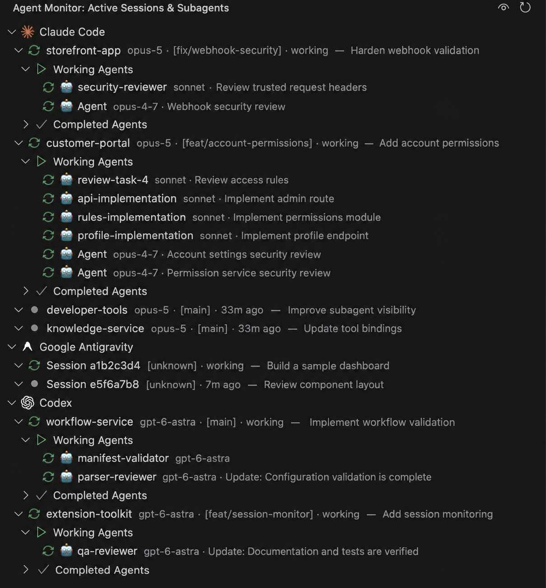

# Agent Monitor: Claude Code, Google Antigravity & Codex

See your local **Claude Code**, **OpenAI Codex** and **Google Antigravity** sessions, agents and subagents in one sidebar. Follow what is working, inspect recent updates and open the underlying logs without switching between tools.



## What you can see

- **All three tools, clearly grouped** — separate Claude Code, Google Antigravity and Codex sections with their original brand icons, adapted for light and dark themes.
- **Sessions and their agents** — working sessions appear first; expand a session to browse working and completed agents, including nested Codex subagents.
- **Useful session details** — project, branch, session title, model and activity time when recorded by the tool.
- **Agent details** — name, status, model and available task text. Codex agents can also show a separately labeled latest update from their own transcript.
- **Live refresh** — file-system events trigger a refresh, batched into half-second windows, with a periodic rescan as a safety net (every 15 seconds by default, configurable).
- **Quick access** — open a session's log or project folder from its row; hover over an agent for its available details.
- **Monitoring on your terms** — use the eye icon to pause or resume monitoring across editor windows.

## Supported tools and local data

| Tool | Data source | Visibility |
| --- | --- | --- |
| **Claude Code** | `~/.claude/projects/` transcripts and subagent metadata | Scoped to the open workspace when workspace folders are present. |
| **OpenAI Codex** | `$CODEX_HOME/sessions/`, or `~/.codex/sessions/` by default | Local sessions across projects, including CLI and VS Code sessions. Child rollouts are joined by recorded parent thread IDs. |
| **Google Antigravity** | `~/.gemini/antigravity-ide/brain/` conversation transcripts | Local sessions across projects. |

On Windows, `~` refers to your user home directory. For a custom Codex location, set `CODEX_HOME` in the environment used to launch the editor.

The extension requires **VS Code 1.90 or later**, or a compatible editor such as Antigravity, and runs on macOS, Linux and Windows. Detection needs no external tools on any of them: file-system events and file timestamps tell the monitor when a transcript was written, the transcript's own content (an unanswered prompt, a running subagent) decides the rest, and the extension never launches other programs. At least one supported tool must have written local logs; the monitor does not start agents or create sessions.

Last validated against **Claude Code 2.1.284** — see the [validation scope and results](docs/claude-code-2.1.284-validation.md).

## Privacy and limitations

Monitoring reads existing logs locally without modifying them. It needs no cloud account, API key or access to Codex's credential files or state database. It does not decrypt protected content.

The sidebar can display real project names, paths and readable conversation excerpts from your logs. Check what is visible before sharing a screenshot; the example above uses fictional text.

Status is inferred from persisted events and activity, so buffered writes or a crashed agent can delay a change. Completed sessions eventually leave the recent-activity view. Models and other details appear only when the underlying tool records them. Log formats can change between tool releases. For Claude Code, a one-time compatibility warning appears when a transcript reports a newer version than the parser's compatibility marker.

See the [Codex log notes](https://github.com/leandrosilvaferreira/claude-agents-view-vscode/blob/main/docs/codex-logs.md) for format details and validation limits, or [development documentation](https://github.com/leandrosilvaferreira/claude-agents-view-vscode/blob/main/docs/DEVELOPMENT.md#claude-code-compatibility) for Claude Code compatibility tracking.

## Install

### From your editor's extension store

Open **Extensions** and search for **Agent Monitor**. Check the extension ID **`leandrosilvaferreira.claude-agents-monitor`** to identify this extension. Antigravity and other compatible editors can use the [Open VSX Registry](https://open-vsx.org).

### From a downloaded VSIX

Download the VSIX from the [latest release](https://github.com/leandrosilvaferreira/claude-agents-view-vscode/releases/latest), then use **Extensions → … → Install from VSIX…**, or run:

```bash
# VS Code
code --install-extension claude-agents-monitor-*.vsix --force

# Antigravity
antigravity-ide --install-extension claude-agents-monitor-*.vsix --force
```

Reload the window with **Developer: Reload Window** from the Command Palette. The **Agent Monitor** icon appears in the activity bar. Initial monitoring starts after a short startup delay, with a loading indicator while sessions are discovered.

The extension's ID is unchanged, so existing installations and settings continue to use `leandrosilvaferreira.claude-agents-monitor`.

## Use the monitor

1. Open **Agent Monitor** in the activity bar.
2. Expand a tool, then a session, then its **Working** or **Completed** agents.
3. Hover over rows for details. Use **Open Log File** or **Open Project Folder** on a session row.
4. Use **Refresh** to rescan, or the eye icon to pause and resume monitoring.

## Configuration

| Setting | Default | Scope | Description |
| --- | --- | --- | --- |
| `claudeAgentsMonitor.enabled` | `true` | Application | Enable monitoring. Turning it off stops log reading across editor windows; turn it back on with the eye icon or this setting. |
| `claudeAgentsMonitor.activityWindowSeconds` | `60` | Application | How long after a transcript's last write a Claude Code or Antigravity session still counts as working (10–1800). Status is re-checked on file events and on every poll, so a session goes idle between the window and the window plus the poll interval, and a turn still in progress can keep it working for up to 30 minutes after the last write. Raise it if sessions flip to idle during long pauses; lower it to see them go idle sooner. |
| `claudeAgentsMonitor.pollIntervalSeconds` | `15` | Application | How often the transcript folders are rescanned as a safety net, even when no file-system event arrives (10–30). It is the only way activity is noticed where file events are unavailable, for example when the operating system's file-watch limit is reached or the transcripts live on a network drive. |

The `claudeAgentsMonitor` prefix is retained for compatibility. `enabled` and `pollIntervalSeconds` apply to **all three tools**; the activity window applies to Claude Code and Antigravity, because Codex status comes from its own turn events. Both tuning settings take effect without reloading the window.

The **Agent Monitor** output channel (**View → Output**, then pick it from the dropdown) lists the folders registered for watching at startup, the detection strategy in use and the active settings, and says when polling is the only detection path. A watcher the operating system stops later is not reported — the periodic rescan still covers it. Check it first if a session does not show as working.

## Development and license

Build and contribution instructions are in [docs/DEVELOPMENT.md](https://github.com/leandrosilvaferreira/claude-agents-view-vscode/blob/main/docs/DEVELOPMENT.md). Report problems through [GitHub issues](https://github.com/leandrosilvaferreira/claude-agents-view-vscode/issues).

[Apache License 2.0](https://github.com/leandrosilvaferreira/claude-agents-view-vscode/blob/main/LICENSE) — Copyright 2026 Leandro Silva Ferreira.

Free to use, modify, extend and redistribute, including commercially, subject to the license. Preserve the [NOTICE](https://github.com/leandrosilvaferreira/claude-agents-view-vscode/blob/main/NOTICE), copyright notices and required change notices when redistributing. Brand names and icons identify the supported integrations; this extension is not affiliated with or endorsed by Anthropic, OpenAI or Google.
